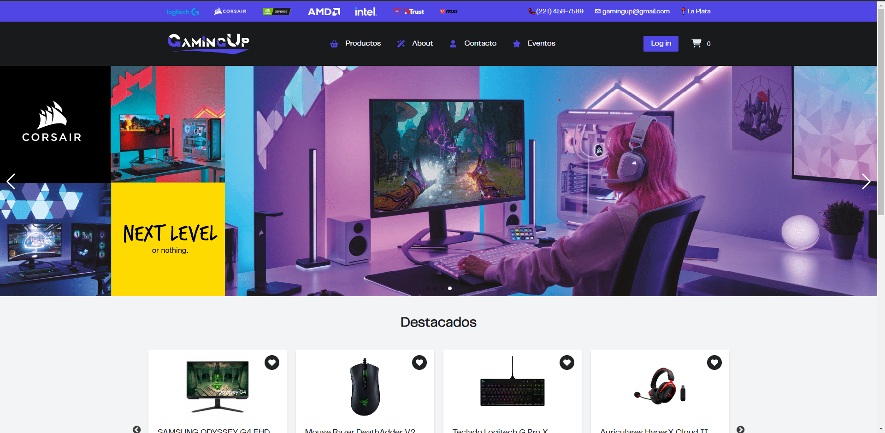
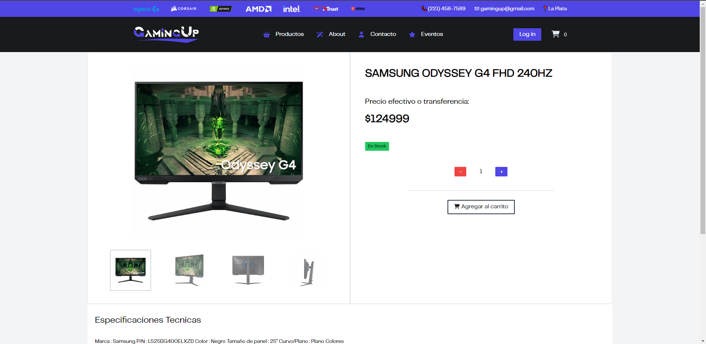
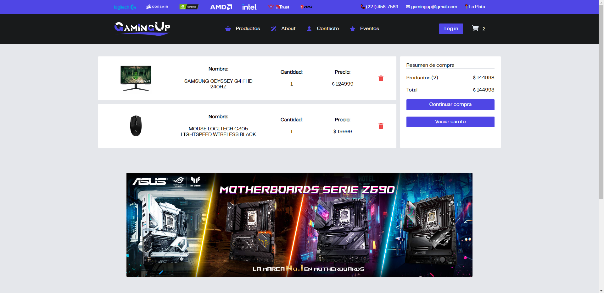
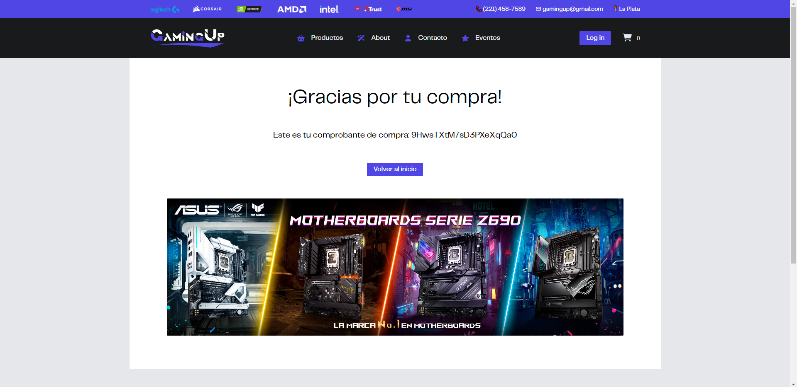

# **Proyecto Final ReactJS CoderHouse 2023** 

[](https://nodesource.com/products/nsolid)

### **Jose Francisco Arce**
### **Contacto:**
[](https://www.linkedin.com/in/jose-francisco-arce-b99824248/)
[](https://github.com/jf-arce)
# *Informacion del proyecto:*

A continuacion una descripcion del proyecto final del curso de ReactJS de [CoderHouse](https://www.coderhouse.com).
Es sobre un Ecommerce especializado en componentes de PC y periféricos de última generación para gaming, el mismo esta desarrollado con Vite.
Para la base de datos se utilizo Firebase tanto para las colecciones de productos como las de ordenes.


## *Version Deployada en VERCEL:*
Link a Vercel del proyecto: 
- [](https://gaming-up.vercel.app/)


**Pantallas de la App:**

### 1. Pantalla principal:
## 

### 2. Detalle del producto seleccionado:

## 

### 3. Carrito de compras con productos seleccionados:

## 

### 5. Compra finalizada exitosamente:

## 

# Para poder usar el proyecto

### Seguir los siguientes pasos:

- Clonar el repositorio de GitHub:

  ```bash
  git clone https://github.com/jf-arce/ProyectoFinal-React-Coder.git
  ```

- Instalar dependencias para VITE:
  ```bash
  npm create vite@latest
  npm install
    ```

- Instalar dependencias en general:
  ```bash
  npm install sass
  npm install -D tailwindcss postcss autoprefixer
  npm tailwindcss init -p
  npm install react-icons 
  npm i --save @fortawesome/fontawesome-svg-core
  npm i --save @fortawesome/free-solid-svg-icons
  npm i --save @fortawesome/free-regular-svg-icons
  npm i --save @fortawesome/react-fontawesome@latest
  npm install react-router-dom
  npm install aos
  npm install sweetalert
  npm install swiper
  npm install react-slick
  npm install firebase
  ```


- Para correr el proyecto:

  ```bash
  npm run dev
  ```


PUSHEAR
https://github.com/jf-arce/ProyectoFinal-React-Coder


